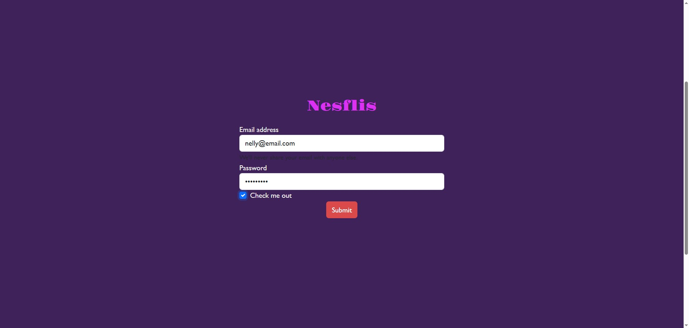
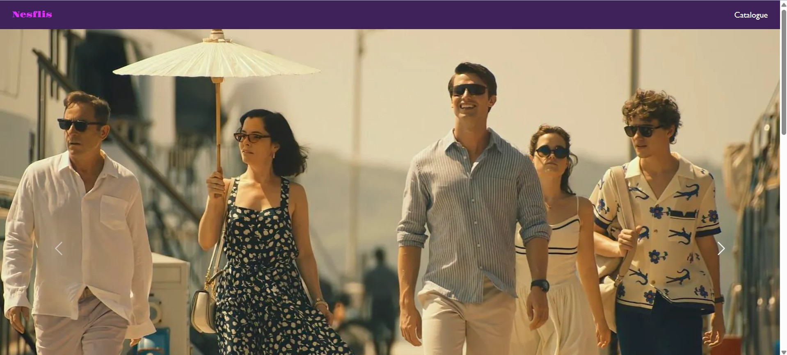
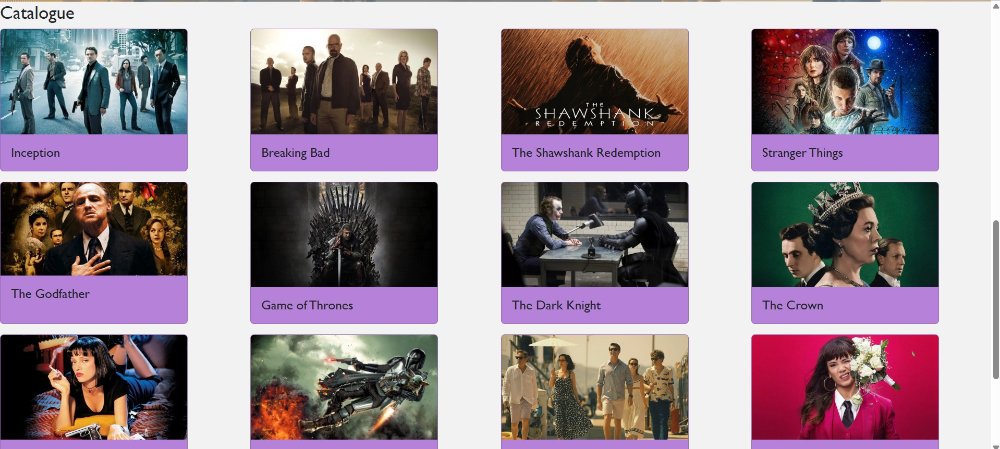
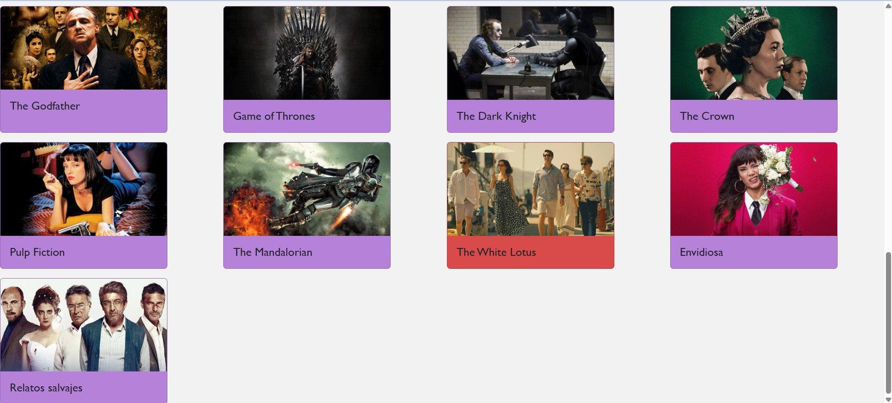
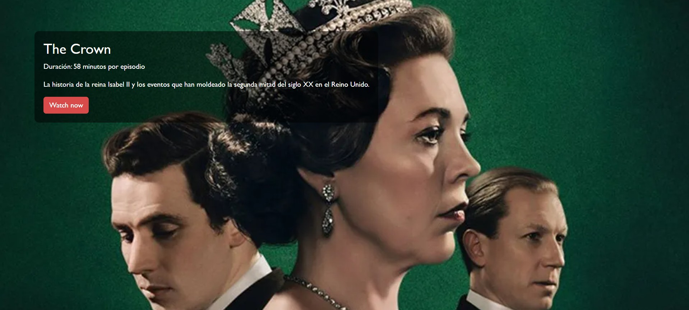
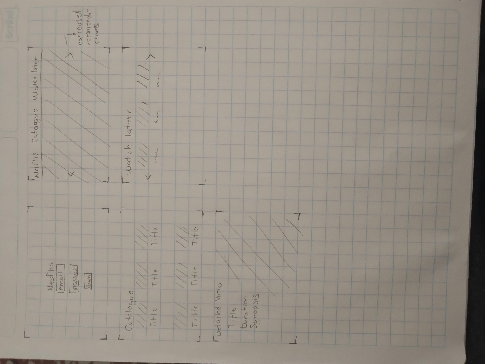

# Title: Nesflis
## Description
Streaming platform made with html, vanilla js and css
## Screenshots
### User login

Se ingresa el correo (cualquiera) y la contraseña (cualquiera) en los campos requeridos
### Main Page

Se muestra la barra de navegacion y un carrousel con las recomendaciones de contenido
### Catalogue of movies and series

Apartado con el catalogo de contenido disponible sacado de peliculas_series.json

Cuando se selecciona un contenido, el elemento cambia de color para identificarlo
### Detailed View of the movie or series selected

Se observa además del título, la duración y sinopsis
## Mockup

## Instrucciones
1. Una vez ya descargado el repositorio, abrir la carpeta desde algun IDE como VScode.
2. Instalar una extension para lanzar cualquier tipo de desarrollo local como Live Server, en caso de no tenerla instalada
3. Dirigirse al archivo que esta en la raiz llamado index.html y una vez dentro, correr el servidor en vivo, con live server aparece un icono en la esquina inferior derecha de VScode con la leyenda "Go Live", hacer clic, esto le abrira una pestaña de su navegador con el login del sistema.
## Descripcion
1. Una vez elaborado el mockup, investigué componentes que me puedan servir en bootstrap.
2. Inicialmente cree tres archivos dentro de la carpeta index.html, style.css y script.js
3. Conecté los demás archivos al index.html y comencé a armar la estructura del login.
4. Creé mainPage.html y realicé lo mismo que con index.html.
5. Descargué imágenes representativas del contenido y creé un json para almacenar los detalles de cada pelicula y serie.
6. En script.js, realicé la lectura del json y presenté algunos detalles en mainPage.html.
7. Procedí a crear la estructura de detailedView.html
## Problemas conocidos
* No es necesario escribir el correo y contraseña para iniciar sesión.
* El boton de "watch now" no hace nada.
* Si se despliega otro archivo html que no sea el index, es probable que las peliculas y series no se desplieguen.
* El carrousel no cuenta con elementos seleccionables.
## Retrospectiva
| Que salio bien? | Que puedo hacer diferente? | Que no salio bien ? |
------------------|----------------------------|-----------------------
| La incorporacion de elementos externos y automatizacion de creacion de elementos html desde js | Una mejor modularizacion del codigo js para evitar repetir lineas y pueda mantener mejor el codigo | El diseño final, el ajuste de tamaños de las imagenes, links y botones que aun no funcionan correctamente |